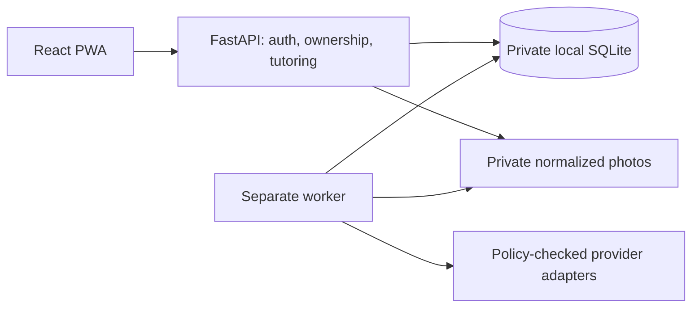

# Shepherd Academy Universe

A self-hosted, multi-subject AI tutor. Choose a topic, receive an activity, work
on paper or type a response, and get guidance on your work. Revise, ask questions,
and choose the next activity. Math, writing, reading, history, social studies,
science and custom topics are supported without a required grade level or fixed
activity catalog.

Photo readings appear before feedback. Clear, task-relevant readings continue
automatically; uncertainty that prevents useful feedback gets specific retake or
clarification advice. Uploaded or pasted assignments are reference material for
concepts and different practice, never tasks for the tutor to complete.

## Current status

Implementation and recorded automated checks are through **T44 (October 8, 2026)**.
The existing private Compose installation was updated to T44 source `62b30ca` on
**October 10, 2026**, at migration `0020_request_recovery`. HTTPS readiness, served
assets and protected endpoints were verified. Current provider selections were
not inspected or changed. T44 requires a fresh tutor connection test; unchanged
photo-reader tests remain valid until normal expiry.

The remaining release work is testing/selecting actual models, human-reviewed
tutoring trials, physical phone/accessibility checks and private-host recovery
and secret custody. Browser-model device measurements are optional
research. See [the current handoff](docs/HANDOFF.md), [recorded evidence](docs/TASKS.md)
and [acceptance checklist](docs/ACCEPTANCE.md). Automated tests and connection
probes do not establish teaching quality or production readiness.

## Start the app

Use Git, GNU Make, Node **24.21.0**, pnpm **12.10.1** and uv **0.12.23**.
uv installs Python **3.14.8** if needed. These are the tested repository pins;
see [DEPENDENCIES](docs/DEPENDENCIES.md).

```bash
make bootstrap
make start
```

`make start` connects to the standard Docker app if it is already running on
port 8000. Otherwise, it creates missing private settings, initializes a fresh
database and starts the UI, API and worker at <http://127.0.0.1:8000> by default.
Existing settings, accounts and data are preserved. Use
[the container runbook](docs/RUNBOOK.md#container-package) for Docker installation.

On first run, open the private setup link printed in the terminal and create the
administrator account in the browser. Open the link within 30 minutes; that
browser then has eight hours to finish setup, including across refreshes and app
restarts. Unsent passwords clear on reload. `make start` renews an expired link
when no administrator exists; it does not reset an existing account. Keep setup
links private.

Loopback HTTP passwords need **6 characters**; network/HTTPS passwords need
**12**, without uppercase or symbol rules. Before moving an installation with
short passwords to HTTPS, stop the API and worker and follow the password recovery
instructions in [RUNBOOK](docs/RUNBOOK.md). `make admin` is the explicit native
reset command; Docker uses the runbook's container command. Resets revoke sessions.

Use `make start` after stopping a native app with Ctrl+C. `make dev` restricts the
same workflow to loopback HTTP. For desktop practice with an iPhone camera, follow
[PHONE_SETUP](docs/PHONE_SETUP.md) for private HTTPS and the expiring QR upload link.
Before a retained database upgrade, stop both writers, back up the data and use
`make migrate start` for native operation or the container runbook for Docker.
Never share live `.env`, private provider settings or learner data with coding agents.

## Configure AI and learner accounts

Sign in as administrator and open **Settings**:

1. **Connections:** save the exact model, endpoint, capabilities and key if needed.
2. **Data & privacy:** review the installation's cloud permission and audience
   ceiling. A local connection never falls back to cloud.
3. **Connection tests:** explicitly authorize synthetic tests for the required
   roles. The tutor test checks activity creation and feedback in two requests;
   the photo-reader test checks one image-reading response. These calls may incur
   provider charges.
4. **Active models:** select the tested tutor and photo reader for future work.
   Saving a connection or passing a test does not activate it.

The default mock supplies labeled synthetic responses and cannot provide real
teaching or general handwriting recognition. An unavailable model produces a
visible error. See [PROVIDER_STATUS](docs/PROVIDER_STATUS.md) for model limits,
Meta thinking effort, role readiness, diagnostics and advanced provider setup.

Keys entered in Settings are write-only and encrypted in the private database.
Preserve the deployment secret separately in backups; changing it requires
re-entering saved keys. Normal setup needs no provider YAML. Advanced operators
can use [the public example](config/providers.example.yaml); file-managed
connections appear read-only in Settings. Explicit environment cloud/audience
restrictions remain enforced.

Open **Learners** to create learner usernames, passwords and age groups. Each
learner signs in through the common sign-in page and sees only their own work.
Administrators who also study create a separate learner account. Administrator
pages manage accounts, connections, exports, revocation and deletion; learner
pages show **Practice**, **History** and **Help**.

## Practice and reading

As a learner, enter a topic and choose **Start session**. The first activity is
created automatically. Use **Send** for work or questions, **Attach photo** for
upload or a phone QR link, **Help** for suggestions and **Next activity options**
to continue. **Session & material** holds reference material and preferences.
Activity difficulty and learner-led, balanced or tutor-led initiative are separate
controls. Students choose when to move on.

Activities show their learning goal and sufficient-response criteria. Feedback
identifies strengths, guidance and fallible observations of resolved and open
points. It distinguishes independent work from work after help when proposing
practice. These observations are guidance, not verified grades or mastery scores.

For reading or study in any subject, paste material, photograph a passage, ask
the tutor to write one, or choose **Published story or news**. Published imports
offer two Aesop stories from a Project Gutenberg mirror and up to five NASA news
passages. Review the preview and attribution before starting. This picker does
not retrieve arbitrary URLs or books, and it sends no learner work to those sources.

Pasted and imported study texts allow **50,000 Unicode codepoints**. Photo
transcriptions, AI-written passages and assignment references allow **8,000**.
Oversized drafts stay visible with an error. Choose **Read in sections** with
short, standard or long sections, or **Use the whole text**. Section mode keeps
future text out of supplied tutor context; prior model knowledge can still cause
spoilers. Reading pace is independent of activity difficulty. Previous/next
section controls save the position, and History preserves it. Next/Easier/Harder
ask another question about the current section.

Whole-text discussion must fit the model's configured context. If generation
fails because the text is too large, open **Reading pace**, choose sections and
select **Apply reading pace**; the saved source remains available. Select up to
1,500 characters in a passage to stage an editable help request. Send or clear
an existing conversation draft first.

Photos accept JPG, PNG, WebP, HEIC or HEIF up to **8 MiB**, including drag and drop.
The server converts them to bounded JPEGs and removes metadata. The phone QR page
needs no learner login and grants only temporary upload access. It shows an
upload receipt; the computer shows the reading and feedback. Readable work
continues despite incidental uncertainty. Rejected reader reports remain
explicitly uncertain conversational context.

## Recovery, privacy and operation

Switching page tabs preserves drafts and retries in memory. Reloading, closing a
tab or switching learners can lose unsent drafts. For pending session, activity,
text and ordinary photo commands, session storage retains only opaque request and
learner identifiers plus command kind. After reload, the browser checks the owned
server receipt without resending work. Use **Check saved request** or **Resolve
interrupted request** when acceptance is unknown. Resolution opens saved work or
excludes delayed acceptance before replacement. Closing the tab clears these
markers; use History for already saved work. The phone companion uses its
separate token-based workflow.

App updates wait while commands are pending and warn about unsent drafts.
Service-worker caches contain public assets only. Submitted work is retained on
the server; history defaults to 30 days. Processed photos are deleted, and
failed/unprocessed photos expire within 24 hours. The worker enforces retention.
Model-call records store safe status, timing and available token counts without
raw prompts, images, responses or keys. There is no separate safety-message
archive, classifier or alert service.



Run one API process and one worker on the same host and local disk. Provider keys
and exact-check answer keys stay on the backend. Models have no autonomous
external tools or authority to change permissions, verified verdicts or workflow
state. Jobs survive restarts and duplicate requests produce one visible result;
a crash after a provider response can require another billed call within the
operation budget. See [RUNBOOK](docs/RUNBOOK.md) for retained-data upgrades,
HTTPS, encrypted backups and restoration.

## Commands and verification

The [Makefile](Makefile) is authoritative.

| Command                                                                  | Purpose                                                                                         |
| ------------------------------------------------------------------------ | ----------------------------------------------------------------------------------------------- |
| `make bootstrap`, `make hooks-install`                                   | Locked installation and local commit checks                                                     |
| `make check`                                                             | Locks, lint, format, types, unit/component tests, builds, contracts, secret scan and IaC checks |
| `make test-integration`                                                  | On-disk migration, ownership, recovery, policy and retention checks                             |
| `make smoke` / `make test-e2e`                                           | Isolated desktop/mobile Chromium workflows                                                      |
| `make eval-mock`                                                         | Math/vision, reading, cross-subject and adversarial synthetic contracts                         |
| `make audit`, `make hooks-check`                                         | Locked dependency audit and repository checks                                                   |
| `make contracts` / `make contracts-check`                                | Regenerate OpenAPI/TypeScript or reject drift                                                   |
| `make format`, `make lint`, `make typecheck`                             | Focused developer checks                                                                        |
| `make start`, `make dev`, `make serve`, `make worker`                    | Persistent start, loopback start, configured HTTPS gateway or worker alone                      |
| `make migrate`                                                           | Upgrade a retained database after stopping both writers                                         |
| `make down`                                                              | Stop Compose while retaining data; native processes use Ctrl+C                                  |
| `make backup OUTPUT=...`, `make restore INPUT=... OUTPUT=... LEDGER=...` | Native encrypted backup/restore with writes stopped                                             |
| `make demo`, `make seed-demo`                                            | Disposable restricted preview, or explicit empty demo database seed                             |

`make demo` uses public synthetic credentials `demo` /
`synthetic-demo-password-only` and blocks tutoring and personal uploads.
Install the test browser with `pnpm exec playwright install --with-deps chromium`,
or set `PLAYWRIGHT_CHROMIUM_EXECUTABLE_PATH` to installed Chrome. Mobile emulation
does not certify physical Safari/Chrome behavior.

Live evaluations are separately opt-in and may be billed. See
[TUTOR_EVALUATION](docs/TUTOR_EVALUATION.md) for actual commands, call limits,
installation configuration and human review. Synthetic evaluator results do not
establish the installed browser/worker loop or learning outcomes. CI also builds
and smoke-tests the non-root image, scans HIGH/CRITICAL vulnerabilities and
creates an SBOM. Recorded runs are in TASKS; configured CI is not observed evidence.

## Contributing and license

Read [AGENTS](AGENTS.md), [SPECIFICATION](docs/SPECIFICATION.md) and
[HANDOFF](docs/HANDOFF.md). Use original synthetic fixtures and record actual
outcomes. [THREAT_MODEL](docs/THREAT_MODEL.md) describes boundaries and
[evals/MANIFEST](evals/MANIFEST.md) records fixture provenance. Review public staged
files individually; never blanket-add local configuration or data.

[MIT licensed](LICENSE), as approved by the maintainer. Dependencies, model
weights and third-party runtime artifacts retain their own licenses.
